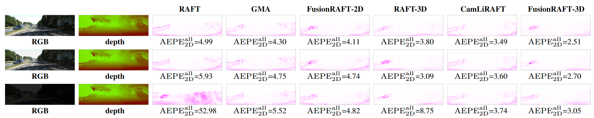
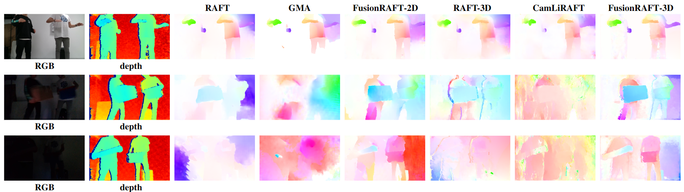

# Attentive Multimodal Fusion for Optical and Scene Flow
## This is the official implementation of FusionRAFT(Accepted by RA-L).

This paper presents an investigation into the estimation of optical and scene flow using RGBD information in scenarios where the RGB modality is affected by noise or captured in dark environments. Existing methods typically rely solely on RGB images or fuse the modalities at later stages, which can result in lower accuracy when the RGB information is unreliable. To address this issue, we propose a novel deep neural network approach named FusionRAFT, which enables early-stage information exchange between sensor modalities (RGB and depth). Our approach incorporates self- and cross-attention layers at different network levels to fuse these modalities and construct informative features that leverage the strengths of both modalities. Through comparative experiments, we demonstrate that our approach outperforms recent methods in terms of performance on the synthetic dataset Flyingthings3D, as well as the generalization on the real-world dataset KITTI. We illustrate that our approach exhibits improved robustness in the presence of noise and low-lighting conditions affecting the RGB images.
## Code come soon
## Tested with
* Ubuntu 20.04
* Cuda 10.1
* pytorch=1.6.0
* torchvision=0.7.0
* cudatoolkit=10.1
## Installation
FusionRAFT requires our LieTorch package to be installed. Please see https://github.com/princeton-vl/lietorch for instructions (requires PyTorch >= 1.6). All Cuda kernels required for FusionRAFT will automatically be installed with LieTorch.
## Download dataset
* FlyingThings3D
* KITTI
* Our datasets
  We recorded a new indoor RGBD dataset using a Realsense D415 camera. This dataset features three lighting setups: Bright, Dimmed, and Dark. Each scenario is further divided into two splits: fast and slow motion. Each sequence contains two or more moving individuals and objects.
## Qualitative results 
* FlyingThings3D

* KITTI

* Our datasets

## Citing our work
<blockquote>
@article{zhou2023FusionRAFT,

  title={{Attentive Multimodal Fusion for Optical and Scene Flow}},

  author={Y. Zhou and G. Mei and Y. Wang and F. Poiesi and Y. Wan},

  journal={IEEE ROBOTICS AND AUTOMATION LETTERS},

  year={2023}
}
</blockquote>

## Acknowledgements
This work was supported by the China government project and by the PNRR project FAIR - Future AI Research, under the NRRP MUR program funded by the NextGenerationEU.
